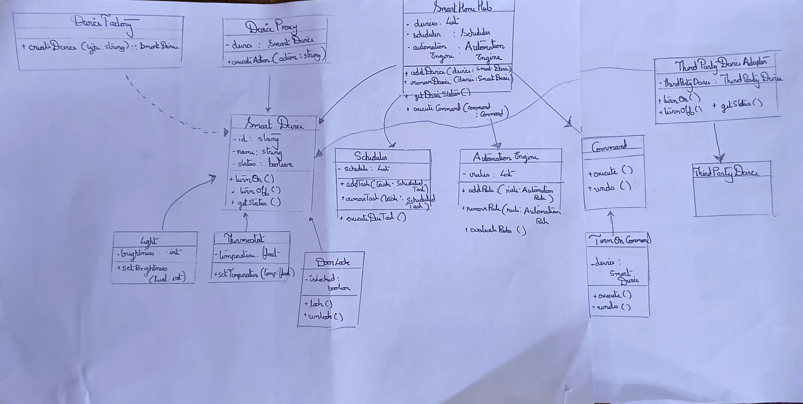

# Smart Home System Simulation

## Table of Contents

- [Project Overview](#project-overview)
- [Features](#features)
- [Technology Stack](#technology-stack)
- [Architecture](#architecture)
- [Design Patterns](#design-patterns)
- [Getting Started](#getting-started)
  - [Prerequisites](#prerequisites)
  - [Installation](#installation)
- [Usage](#usage)
- [Testing](#testing)
- [Contributing](#contributing)
- [License](#license)
- [Acknowledgments](#acknowledgments)

## Project Overview

The Smart Home System Simulation is a console-based application that models the functionality of a modern smart home. This project demonstrates the implementation of various software design patterns, object-oriented programming principles, and best practices in software development.

The primary goal is to create a flexible, extensible system that can manage various smart devices within a home environment, showcasing how different design patterns can be used together to solve real-world problems in software architecture.

## Features

- **Device Management**: Add, remove, and control various smart devices (lights, thermostats, door locks).
- **Scheduling**: Set up schedules for device operations.
- **Automation**: Create and execute rules based on device states or environmental conditions.
- **Status Monitoring**: View real-time status of all connected devices.
- **Third-party Integration**: Capability to integrate non-standard devices into the system.

## Technology Stack

- Language: TypeScript
- Testing Framework: Jest
- Build Tool: npm

## Architecture

The system is built around a central `SmartHomeHub` that manages all devices and operations. Key components include:

- `SmartDevice`: Base class for all smart devices
- `DeviceFactory`: Creates different types of smart devices
- `Scheduler`: Manages scheduled tasks
- `AutomationEngine`: Handles automation rules
- `Command`: Interface for all device commands

Below is a high-level diagram of the system architecture:



## Design Patterns

This project implements six key design patterns:

1. **Observer Pattern** (Behavioral): For notifying system components of device state changes.
2. **Command Pattern** (Behavioral): To encapsulate and queue device operations.
3. **Factory Method** (Creational): For creating different types of smart devices.
4. **Singleton** (Creational): To ensure a single point of control via the Smart Home Hub.
5. **Proxy Pattern** (Structural): To provide controlled access to sensitive device operations.
6. **Adapter Pattern** (Structural): To integrate third-party devices with different interfaces.

## Getting Started

### Prerequisites

- Node.js (v14.0.0 or later)
- npm (v6.0.0 or later)

### Installation

1. Clone the repository:
   ```
   git clone https://github.com/yourusername/smart-home-simulation.git
   ```
2. Navigate to the project directory:
   ```
   cd smart-home-simulation
   ```
3. Install dependencies:
   ```
   npm install
   ```

## Usage

To run the simulation:

```
npm start
```

Follow the on-screen prompts to interact with the Smart Home System.

## Testing

To run the test suite:

```
npm test
```

## Contributing

We welcome contributions to the Smart Home System Simulation project. Please follow these steps:

1. Fork the repository
2. Create your feature branch (`git checkout -b feature/AmazingFeature`)
3. Commit your changes (`git commit -m 'Add some AmazingFeature'`)
4. Push to the branch (`git push origin feature/AmazingFeature`)
5. Open a Pull Request

Please ensure your code adheres to the existing style and includes appropriate tests.

## License

This project is licensed under the MIT License - see the [LICENSE.md](LICENSE.md) file for details.

## Acknowledgments

- This project was inspired by real-world smart home systems and IoT architectures.
- Special thanks to the open-source community for providing invaluable resources and tools.
