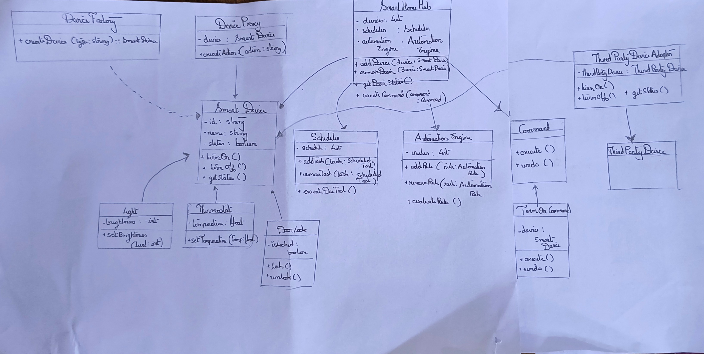
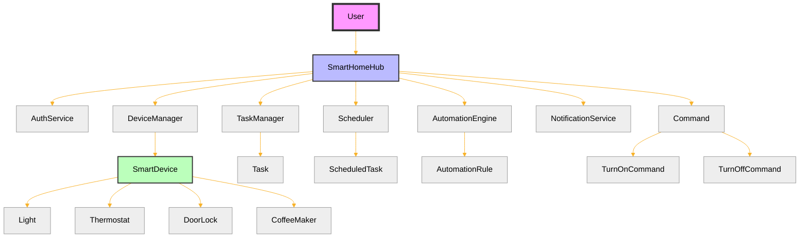

# Smart Home System Simulation

## Demo

Check out our demo video to see the Smart Home System Simulation in action

[Watch Demo Video](https://youtu.be/34Ev7jrIM8E)

## Table of Contents

- [Exercise Implementation](#exercise-implementation)
- [Use Cases](#use-cases)
- [User Guides](#user-guides)
- [Project Overview](#project-overview)
- [Features](#features)
- [Technology Stack](#technology-stack)
- [Architecture](#architecture)
- [Design Patterns](#design-patterns)
- [Getting Started](#getting-started)
- [Usage](#usage)
- [Testing](#testing)
- [Contributing](#contributing)
- [License](#license)
- [Acknowledgments](#acknowledgments)

## Exercise Implementation

This project fulfills the requirements of Exercise 1 and Exercise 2 as follows:

### Exercise 1: Design Patterns

We have implemented six different design patterns, demonstrating their practical application in a smart home system:

1. Observer Pattern (Behavioral): Used for notifying system components of device state changes.
2. Command Pattern (Behavioral): Implemented to encapsulate and queue device operations.
3. Factory Method (Creational): Applied for creating different types of smart devices.
4. Singleton (Creational): Ensures a single point of control via the Smart Home Hub.
5. Proxy Pattern (Structural): Provides controlled access to sensitive device operations.
6. Adapter Pattern (Structural): Enables integration of third-party devices with different interfaces.

### Exercise 2: Smart Home System

We have created a comprehensive Smart Home System that includes:

- Device Management: Adding, removing, and controlling various smart devices.
- Task Management: Creating, editing, and tracking tasks.
- Scheduling: Setting up schedules for device operations and tasks.
- Automation: Creating and executing rules based on device states or conditions.
- User Authentication: Secure login and registration system.
- Multi-user Support: Each user has their own devices, tasks, and automation rules.

## Use Cases

Our Smart Home System supports the following key use cases:

1. User can add and control various smart devices (lights, thermostats, door locks).
2. User can create and manage tasks with priorities and deadlines.
3. User can schedule tasks and device operations for future execution.
4. User can set up automation rules to control devices based on specific conditions.
5. User can monitor the status of all connected devices in real-time.
6. System can integrate third-party devices using the Adapter pattern.

## User Guides

Detailed guides for using each component of the Smart Home System:

- [Login and Registration Guide](docs/guides/login_guide.md)
- [Task Management Guide](docs/guides/task_management_guide.md)
- [Device Management Guide](docs/guides/device_management_guide.md)
- [Scheduler Guide](docs/guides/scheduler_guide.md)
- [Automation Guide](docs/guides/automation_guide.md)

## Project Overview

The Smart Home System Simulation is a console-based application that models the functionality of a modern smart home. This project demonstrates the implementation of various software design patterns, object-oriented programming principles, and best practices in software development.

The primary goal is to create a flexible, extensible system that can manage various smart devices within a home environment, showcasing how different design patterns can be used together to solve real-world problems in software architecture.

## Features

- **Device Management**: Add, remove, and control various smart devices (lights, thermostats, door locks).
- **Scheduling**: Set up schedules for device operations.
- **Automation**: Create and execute rules based on device states or environmental conditions.
- **Status Monitoring**: View real-time status of all connected devices.
- **Third-party Integration**: Capability to integrate non-standard devices into the system.

## Technology Stack

- Language: TypeScript
- Testing Framework: Jest
- Build Tool: npm

## Architecture

The system is built around a central `SmartHomeHub` that manages all devices and operations. Key components include:

- `SmartDevice`: Base class for all smart devices
- `DeviceFactory`: Creates different types of smart devices
- `Scheduler`: Manages scheduled tasks
- `AutomationEngine`: Handles automation rules
- `Command`: Interface for all device commands

Below is a high-level diagram of the system architecture:



The system is built around a central `SmartHomeHub` that manages all devices and operations. Key components include:

- `SmartDevice`: Base class for all smart devices
- `DeviceFactory`: Creates different types of smart devices
- `Scheduler`: Manages scheduled tasks
- `AutomationEngine`: Handles automation rules
- `Command`: Interface for all device commands

Below is a high-level diagram of the system architecture:




For a detailed view of the project structure, see below:

```mermaid
%%{init: {'theme': 'neutral', 'themeVariables': { 'primaryColor': '#BB2528', 'primaryTextColor': '#fff', 'primaryBorderColor': '#7C0000', 'lineColor': '#F8B229', 'secondaryColor': '#006100', 'tertiaryColor': '#ff0000'}}}%%
graph TD
    A[Smart Home System] --> B[src]
    A --> C[docs]
    A --> D[tests]
    A --> E[package.json]
    A --> F[tsconfig.json]
    A --> G[README.md]

    B --> BA[core]
    B --> BB[devices]
    B --> BC[utils]
    B --> BD[auth]
    B --> BE[commands]
    B --> BF[index.ts]

    BA --> BA1[SmartHomeHub.ts]
    BA --> BA2[SmartDevice.ts]
    BA --> BA3[Task.ts]

    BB --> BB1[Light.ts]
    BB --> BB2[Thermostat.ts]
    BB --> BB3[DoorLock.ts]
    BB --> BB4[CoffeeMaker.ts]

    BC --> BC1[Scheduler.ts]
    BC --> BC2[AutomationEngine.ts]
    BC --> BC3[NotificationService.ts]

    BD --> BD1[AuthService.ts]

    BE --> BE1[Command.ts]
    BE --> BE2[TurnOnCommand.ts]
    BE --> BE3[TurnOffCommand.ts]

    C --> CA[guides]
    C --> CB[images]
    C --> CC[diagrams]

    CA --> CA1[login_guide.md]
    CA --> CA2[task_management_guide.md]
    CA --> CA3[device_management_guide.md]
    CA --> CA4[scheduler_guide.md]
    CA --> CA5[automation_guide.md]

    CB --> CB1[system-design.jpg]

    CC --> CC1[project_structure.mmd]
    CC --> CC2[system_architecture.mmd]

    D --> D1[core.test.ts]
    D --> D2[devices.test.ts]
    D --> D3[utils.test.ts]
    D --> D4[auth.test.ts]
```



For a detailed view of the project structure, see the [Project Structure Diagram](docs/diagrams/project-structure-mermaid.mmd).

## Design Patterns

This project implements six key design patterns:

1. **Observer Pattern** (Behavioral): For notifying system components of device state changes.
2. **Command Pattern** (Behavioral): To encapsulate and queue device operations.
3. **Factory Method** (Creational): For creating different types of smart devices.
4. **Singleton** (Creational): To ensure a single point of control via the Smart Home Hub.
5. **Proxy Pattern** (Structural): To provide controlled access to sensitive device operations.
6. **Adapter Pattern** (Structural): To integrate third-party devices with different interfaces.

## Getting Started

### Prerequisites

- Node.js (v14.0.0 or later)
- npm (v6.0.0 or later)

### Installation

1. Clone the repository:
   ```
   git clone https://github.com/yourusername/smart-home-simulation.git
   ```
2. Navigate to the project directory:
   ```
   cd smart-home-simulation
   ```
3. Install dependencies:
   ```
   npm install
   ```

## Usage

To run the simulation:

```
npm start
```

Follow the on-screen prompts to interact with the Smart Home System.

## Testing

To run the test suite:

```
npm test
```

## Contributing

We welcome contributions to the Smart Home System Simulation project. Please follow these steps:

1. Fork the repository
2. Create your feature branch (`git checkout -b feature/AmazingFeature`)
3. Commit your changes (`git commit -m 'Add some AmazingFeature'`)
4. Push to the branch (`git push origin feature/AmazingFeature`)
5. Open a Pull Request

Please ensure your code adheres to the existing style and includes appropriate tests.

## License

This project is licensed under the MIT License - see the [LICENSE.md](LICENSE.md) file for details.

## Acknowledgments

- This project was inspired by real-world smart home systems and IoT architectures.
- Special thanks to the open-source community for providing invaluable resources and tools.
